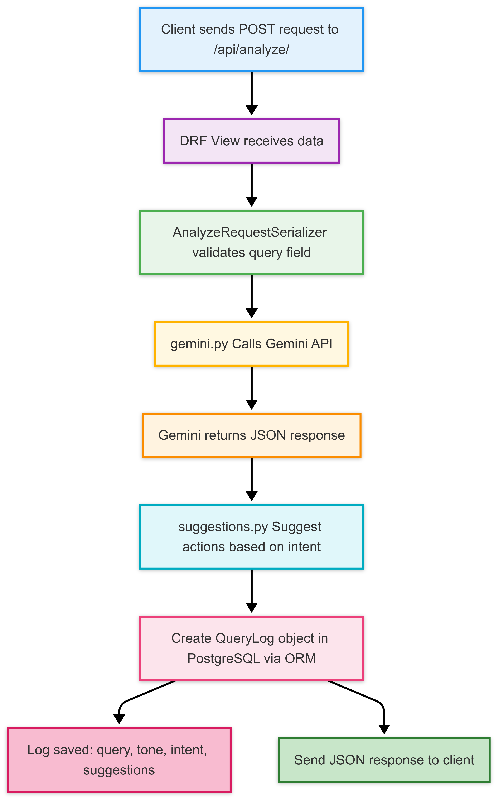

# Action Suggester API

This project is a lightweight Django REST API service that analyzes a user's short text message and suggests relevant actions based on its tone and intent. It uses Google's Gemini LLM API to understand the message and stores the results in a PostgreSQL database (hosted on Neon).

When a user sends a message (e.g., "I want to order pizza"), the system:
- Calls the Gemini API to determine the **tone** (e.g., Happy, Urgent) and **intent** (e.g., Order Food, Ask Question)
- Suggests 1–3 predefined relevant actions (e.g., Order Food Online, Find Pizza Recipes)
- Logs the query, analysis, and suggestions to the database 

## LLM Provider

This project uses **Google's Gemini** API as the LLM (Large Language Model) provider to analyze the user's input and extract tone and intent.

To use Gemini, you'll need an API key from **Google AI Studio** and include it in your `.env` file as `GEMINI_API_KEY`.

## Flow Diagram



## API Endpoint
### **POST** `/api/analyze/`

Analyzes a user's text message using Google's Gemini API to determine its **tone** and **intent**, suggests 1–3 relevant actions, and logs the result to the PostgreSQL database.

---

### 📥 Request Body (JSON) [For Postman]

```json
{
  "query": "I want to travel to Spain"
}
```

### 📥 Successful Response (HTTP 200)
```json
{
  "query": "I want to travel to Spain",
  "analysis": {
    "tone": "Neutral",
    "intent": "Book Travel"
  },
  "suggested_actions": [
    {
      "action_code": "SEARCH_FLIGHTS",
      "display_text": "Search for Flights"
    },
    {
      "action_code": "BOOK_HOTEL",
      "display_text": "Book a Hotel Room"
    },
    {
      "action_code": "CHECK_WEATHER",
      "display_text": "Check Weather at Your Destination"
    }
  ]
}
```


## 🛠️ Tech Stack  

| Technology         | Purpose                                                                 |
|--------------------|-------------------------------------------------------------------------|
| **Python 3.x**     | Core programming language used to build the backend                    |
| **Django**         | High-level Python web framework used to build the API structure         |
| **Django REST Framework (DRF)** | Simplifies building RESTful APIs with serializers, views, and routing   |
| **Google Gemini API** | Large Language Model (LLM) used to analyze the tone and intent of user messages |
| **Neon Serverless PostgreSQL** | Cloud-based PostgreSQL database used to log and persist query analysis results |
| **python-dotenv**  | Loads environment variables (e.g., Gemini API key) securely from `.env` file |
| **requests**       | Used to make HTTP requests to the Gemini API from the backend           |
| **PostgreSQL**     | Relational database used via Django ORM to store logs and responses     |
| **Git & GitHub**   | Version control and code hosting                                        |


## Setting Up the Project  

To set up and run this project locally, follow these steps:  

### Clone the Repository  
First, clone the project from GitHub:  

```sh
git clone https://github.com/thecodephilic-guy/action-suggester.git
cd action-suggester
```
### Create & Activate a Virtual Environment
```bash
python -m venv venv         #use python3 if on macOS
# Activate virtual environment:
source venv/bin/activate   # Linux/macOS
venv\Scripts\activate      # Windows
```

### Install Dependencies
```bash
pip install -r requirements.txt
```

### Configure Environment Variables
Create a .env file in the root directory of the project:
```bash
touch .env
```
Paste the following into .env (replace with your actual credentials):
```bash
GEMINI_API_KEY=<your-gemini-api-key>
DATABASE_URL='DATABASE_URL=postgresql://action-suggester_owner:<your-password>@<your-neon-url>/action-suggester?sslmode=require'
SECRET_KEY='<your-django-secret-key-from-action-suggester/settings.py>' # Found in settings.py or generate a new one
```
🔐 Do NOT commit your .env file to GitHub. It contains sensitive credentials.

### Configure Django Settings for Neon (Optional if you are using another DB)
In your action_suggester/settings.py, update the database settings:
```python
# Add these at the top
import os
from dotenv import load_dotenv
from urllib.parse import urlparse

load_dotenv()

# Replace your existing DATABASES block with this:
tmpPostgres = urlparse(os.getenv("DATABASE_URL"))

DATABASES = {
    'default': {
        'ENGINE': 'django.db.backends.postgresql',
        'NAME': tmpPostgres.path.replace('/', ''),
        'USER': tmpPostgres.username,
        'PASSWORD': tmpPostgres.password,
        'HOST': tmpPostgres.hostname,
        'PORT': 5432,
    }
}
```

### Apply Database Migrations
```bash
python manage.py makemigrations
python manage.py migrate
```

### Run the Server
```bash
python manage.py runserver
```

Visit:
📍 http://127.0.0.1:8000/api/analyze/

## Testing the API
Use Postman, curl, or any REST client to test:

POST /api/analyze/

Request Body:
```json
{
  "query": "I want to order pizza"
}
```

## Conclusion

This project demonstrates how AI can be seamlessly integrated into modern web applications to derive insights from natural language and provide intelligent, actionable suggestions — all within a clean, scalable, and production-ready Django framework.